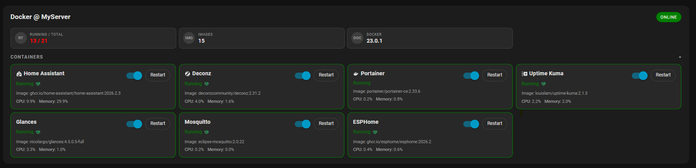
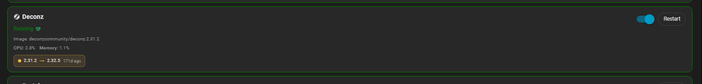

# Docker Card Extended
An extended version of Docker Card, inspired by [vineetchoudhary/lovelace-docker-card](https://github.com/vineetchoudhary/lovelace-docker-card), that lets you view and control your Docker containers from Home Assistant.



## Contents
- [Features](#features)
- [How it works](#how-it-works)
- [Requirements](#requirements)
- [Installation](#installation)
- [Quick start](#quick-start)
- [Configuration options](#configuration-options)
- [Pause / Resume](#pause--resume)
- [Resource graphs (CPU / Memory)](#resource-graphs-cpu--memory)
- [WUD integration](#wud-integration)
- [Full example configuration](#full-example-configuration)
- [Styling](#styling)
- [Without Portainer](#without-portainer)
- [Troubleshooting](#troubleshooting)
- [Changelog](#changelog)
- [Development](#development)
- [License](#license)

## Features
- Compact overview of your Docker host (container counts, Docker version, OS, daemon state)
- Auto-updating container list with live state badges and control actions
- Collapsible container section
- Responsive multi-column layout that adapts to screen size — set `columns: 3` for three columns on wide screens, automatically reduces on smaller screens
- Per-container icons, health status indicators, and image version display
- **Pause / Resume support** — pause and resume individual containers directly from the card; paused containers are highlighted in amber and the toggle switch is automatically disabled to prevent invalid state transitions
- **CPU / Memory sparkline graphs** — opt-in full-width history graphs per container with an adaptive time axis and day breaks, rendered as lightweight inline SVG from the Home Assistant history API; no extra dependencies
- **WUD update tracking** — shows available updates with current → new version and how many days the update has been available (requires a running [What's Up Docker](https://github.com/getwud/wud) instance and the [WUD Monitor](https://github.com/johro897/wud-monitor) HA integration)
- **WUD overview tiles** — shows last scan time and a one-click Force Scan button directly in the card overview
- Theme-aware styling with configurable running / paused / not-running accent colors
- Works out-of-the-box with entities from the Portainer integration; also supports any toggle-friendly domain (`switch`, `input_boolean`, `light`, etc.)
- Optional tap/hold actions per container row for quick navigation, service calls, or external links

## How it works
> [!IMPORTANT]
> **This card does not discover anything automatically — not even from Portainer.** It has no Docker socket access and never talks to Docker or Portainer directly. Instead, *you* list each container in YAML and tell the card exactly which Home Assistant entity represents its status, its start/stop switch, and so on. The card then simply displays and reacts to those entities.
>
> If the Portainer integration is installed and running but you haven't added anything under `containers:` yet, the card will correctly show **"No containers configured."** — that message means exactly what it says: no YAML list, no containers shown. It is not an error and does not mean anything is broken. See [Quick start](#quick-start) below to add your first container.

This indirection is deliberate: it's what lets the same card work with Portainer, with plain `command_line` sensors ([see Without Portainer](#without-portainer)), or with any other integration that exposes container state as entities — the card doesn't care where an entity comes from, only that it exists.

One consequence worth knowing up front: **entity IDs are generated by whichever integration provides them, not by this card**, and their exact names depend on your setup. If your Home Assistant instance runs in a language other than English, integrations that generate entity IDs from device/container names (Portainer included) may produce different, localized IDs than the English examples shown in this README. Always confirm your *actual* entity IDs in **Developer Tools → States** (filter by `docker` or your container's name) rather than assuming the examples below match your instance verbatim.

## Requirements
- Home Assistant 2025.8 or newer
- Docker managed via the official Portainer integration (provides all referenced sensors, switches, and buttons)
- **Optional but recommended:** A running [What's Up Docker (WUD)](https://github.com/getwud/wud) instance (tested with WUD 8.2+) with the [WUD Monitor](https://github.com/johro897/wud-monitor) HA integration installed — required for update tracking and scan controls
- Optional: For non-Portainer environments, equivalent entities (sensors, binary_sensors, switches, scripts, etc.) that expose Docker data and operations

## Installation
### 1. Via HACS (recommended)
Docker Card Extended is available directly in the HACS default catalog. Search for **Docker Card Extended** under **Frontend** in HACS and install it — no custom repository needed.

[](https://my.home-assistant.io/redirect/hacs_repository/?owner=johro897&repository=docker-card-extended&category=dashboard)

### 2. Manual install
1. Copy `docker-card.js` to `/config/www/docker-card-extended/docker-card.js`
2. Add the resource via **Settings → Dashboards → Resources → +**:
   ```yaml
   url: /local/docker-card-extended/docker-card.js
   type: module
   ```
3. Hard-refresh your browser (`Ctrl/Cmd + Shift + R`)

## Quick start
This walks through the minimum needed to see one real container on the card. It assumes you've already completed [Installation](#installation) above.

1. **Install the Portainer integration**, if you haven't already: **Settings → Devices & Services → + → Portainer**.
2. **Find your actual entity IDs.** Go to **Developer Tools → States** and filter for one container you want to show, e.g. type its name in the filter box. You're looking for at minimum:
   - a **sensor** entity for its status (state values like `running` / `exited` / `paused`) — this becomes `status_entity`
   - a **switch** entity to start/stop it — this becomes `control_entity`

   > [!NOTE]
   > The exact names depend on your setup and language — see [How it works](#how-it-works). Don't skip this step and paste the examples below verbatim; confirm the real IDs first.
3. **Add the card** to a dashboard (**Edit Dashboard → Add Card → Manual**) with a minimal `containers:` list, substituting the entity IDs you just found:
   ```yaml
   type: custom:docker-card
   containers:
     - name: Home Assistant
       status_entity: sensor.home_assistant_state
       control_entity: switch.home_assistant_container
   ```
4. **Save.** You should now see one container row with a live status badge and a toggle. If you instead see **"No containers configured."**, double-check that the `containers:` list above was actually saved as part of the card's YAML (see [Troubleshooting](#troubleshooting)).
5. From here, add more entries to `containers:` for your other containers, and optionally add a `docker_overview:` block for the host-level summary tile — see [Configuration options](#configuration-options) for everything available, or jump to [Pause / Resume](#pause--resume), [Resource graphs](#resource-graphs-cpu--memory), and [WUD integration](#wud-integration) for the deeper features.

## Configuration options
### Card options
| Option | Required | Default | Description |
| --- | --- | --- | --- |
| `title` | No | `Docker Card` | Card header text |
| `containers_expanded` | No | `false` | Expand container list on load |
| `columns` | No | `1` | Maximum number of columns — reduces automatically on smaller screens |
| `running_color` | No | Theme value | Global accent color for running containers |
| `not_running_color` | No | Theme value | Global accent color for stopped containers |
| `paused_color` | No | `#f4b942` (amber) | Global accent color for paused containers |
| `graphs` | No | `false` | Show CPU/Memory history sparklines instead of plain text values — overridable per container |
| `graph_hours` | No | `2` | History window for graphs, in hours — overridable per container |
| `graph_height` | No | `34` | Graph height in pixels — overridable per container |
| `graph_refresh` | No | `300` | Minimum seconds between history refetches per entity — overridable per container (floor: `30`, lower values are raised automatically) |
| `graph_cpu_color` | No | `var(--primary-color)` | Line/area color for CPU graphs — overridable per container |
| `graph_memory_color` | No | `var(--accent-color)` | Line/area color for Memory graphs — overridable per container |
| `docker_overview` | No | — | High-level Docker host stats |
| `containers` | **Yes** | — | Array of container definitions |

### docker_overview options
| Option | Description |
| --- | --- |
| `status` | Binary sensor for overall Docker daemon state |
| `container_count` | Total number of containers |
| `containers_running` | Number of running containers |
| `containers_paused` | Number of paused containers — enables the expanded `running · paused · stopped` display |
| `containers_stopped` | Number of stopped containers — enables the expanded `running · paused · stopped` display |
| `docker_version` | Docker version string |
| `image_count` | Number of Docker images |
| `operating_system` | Host OS name |
| `operating_system_version` | Host OS version |
| `wud_last_poll` | WUD Monitor sensor — shows timestamp of last WUD scan |
| `wud_scan` | WUD Monitor button — click to trigger an immediate scan of all containers |

### Container options
| Option | Required | Description |
| --- | --- | --- |
| `name` | No | Display name (defaults to entity friendly name) |
| `icon` | No | MDI icon, e.g. `mdi:home-assistant` |
| `status_entity` | Preferably | Entity whose state represents container status — use a `sensor`, not a `binary_sensor`, to get text states like `running`, `paused`, `stopped` |
| `control_entity` | Conditional | Entity supporting `turn_on`/`turn_off` to start/stop the container |
| `control_domain` | No | Override domain for `control_entity` |
| `restart_entity` | No | Entity to trigger a restart (`button`, `switch`, `script`, etc.) |
| `restart_domain` | No | Override domain for `restart_entity` |
| `pause_entity` | No | Entity to trigger a pause (`button`, `script`, `automation`) |
| `resume_entity` | No | Entity to trigger a resume (`button`, `script`, `automation`) |
| `cpu_entity` | No | Sensor for CPU usage. Displayed in whatever unit the sensor itself declares (`%` if none is set) |
| `memory_entity` | No | Sensor for memory usage — percentage or an absolute unit like `MB`/`GB`. Displayed in whatever unit the sensor itself declares (`%` if none is set) |
| `graphs` | No | Per-container override of the card-level `graphs` setting (`true`/`false`) |
| `graph_hours` | No | Per-container history window in hours |
| `graph_height` | No | Per-container graph height in pixels |
| `graph_refresh` | No | Per-container minimum seconds between history refetches |
| `graph_cpu_color` | No | Per-container override for CPU graph color |
| `graph_memory_color` | No | Per-container override for Memory graph color |
| `image_version_entity` | No | Sensor showing the current image tag/version |
| `health_entity` | No | Sensor for container health (`healthy`, `unhealthy`, `starting`) |
| `update_entity` | No | WUD Monitor sensor for update tracking — requires WUD + WUD Monitor integration |
| `running_color` | No | Per-container override for running accent color |
| `not_running_color` | No | Per-container override for stopped accent color |
| `paused_color` | No | Per-container override for paused accent color |
| `running_states` | No | Custom list of states that count as "running" |
| `stopped_states` | No | Custom list of states that count as "stopped" |
| `paused_states` | No | Custom list of states that count as "paused" (default: `["paused", "pause"]`) |
| `tap_action` | No | Action on row tap (standard Lovelace action object) |
| `hold_action` | No | Action on long-press |
| `hold_delay` | No | Hold detection delay in ms (default: `500`) |
| `switch_entity` | No | Legacy alias for `control_entity` |

> **Tip:** `binary_sensor` entities only report `on` or `off` and cannot represent a `paused` state. Always use a `sensor` for `status_entity` if you need pause detection or accurate stopped/running text states.

Color values fall back to Home Assistant theme variables (`var(--state-active-color)`, `var(--state-error-color)`) when omitted. The legacy key `stopped_color` still maps to `not_running_color`, and `switch_domain` still maps to `control_domain`, for backward compatibility.

## Pause / Resume
Containers can be paused and resumed directly from the card without stopping them. When a container is paused:
- The row border and status text turn **amber**
- The toggle switch is **disabled** — start/stop is not available while paused
- The **Pause** button changes to **Resume**

Add `pause_entity` and `resume_entity` to a container pointing to the corresponding Portainer buttons:
```yaml
containers:
  - name: Uptime Kuma
    status_entity: sensor.uptime_kuma_state
    control_entity: switch.uptime_kuma_container
    pause_entity: button.uptime_kuma_pause_container
    resume_entity: button.uptime_kuma_resume_container
    restart_entity: button.uptime_kuma_restart_container
    icon: mdi:timeline-plus
```
The Pause / Resume button is only shown when the container is **running** or **paused** — it is hidden for stopped containers.

### Overview — Running · Paused · Stopped
When `containers_paused` and/or `containers_stopped` are configured in `docker_overview`, the running tile expands to show a full breakdown:
```
2 running · 1 paused · 3 stopped
```
Without those sensors the tile falls back to the compact `running / total` format.

## Resource graphs (CPU / Memory)
Set `graphs: true` to replace the plain CPU/Memory text with mini sparkline graphs per container. The graphs span the full width of the card row, below the name and action buttons, and each one shows the sensor's recent history, a time axis, and the current live value:
```yaml
type: custom:docker-card
graphs: true          # enable for the whole card
graph_hours: 6        # history window in hours (default: 2)
graph_height: 34      # graph height in px (default: 34)
graph_refresh: 300    # seconds between history refetches (default: 300)
containers:
  - name: Home Assistant
    status_entity: sensor.home_assistant_state
    control_entity: switch.home_assistant_container
    cpu_entity: sensor.home_assistant_cpu_usage
    memory_entity: sensor.home_assistant_memory_usage
    graph_hours: 48   # this one gets a longer window
    graph_height: 48
  - name: Deconz
    status_entity: sensor.deconz_state
    control_entity: switch.deconz_container
    cpu_entity: sensor.deconz_cpu_usage
    memory_entity: sensor.deconz_memory_usage
    graphs: false     # no graphs for this container
```
> [!TIP]
> **Every `graph_*` option can be set both card-wide and per container** — `graphs`, `graph_hours`, `graph_height`, `graph_refresh`, `graph_cpu_color` and `graph_memory_color`. The container value always wins, so you can keep a short default window for the card and give a few noisy containers a longer one.

### Time axis
Each graph has a time axis underneath that adapts to the window length:
| Window | Axis |
| --- | --- |
| Less than a day | Clock times (start · middle · end) with a gridline at the midpoint |
| Spanning 1–6 midnights | A dashed gridline at every local midnight, with the weekday label pinned to it |
| More than a week | Three labels showing date + time (e.g. `29 Jul 14:00`) |

Times and dates follow your Home Assistant language setting.

### How the graphs work
- History is fetched from the Home Assistant REST history API (`minimal_response`, `no_attributes`) and cached per entity **and** window, so containers with different `graph_hours` never overwrite each other's data
- The card re-renders on every state change in HA, but the API is never called more often than `graph_refresh` (stale-while-revalidate). Changing a window in the YAML clears the cache immediately
- The current sensor state is always appended as the last point, so the graph never lags behind the displayed value
- Series are downsampled to at most 120 points per graph to keep the DOM light
- Graphs are pure inline SVG — no external chart libraries
- CPU and Memory sit side by side when the row is wide enough and stack automatically on narrow screens

**Colors** default to `var(--primary-color)` for CPU and `var(--accent-color)` for Memory. Override globally with `graph_cpu_color` / `graph_memory_color`, or per container with the same keys.

> [!NOTE]
> The `cpu_entity` / `memory_entity` sensors must be included in the [recorder](https://www.home-assistant.io/integrations/recorder/) — excluded entities have no history and the graph shows *no history* (the current value is still displayed). The axis reflects the data that actually exists, so a graph can be shorter than the window you asked for if the recorder has nothing older. With `graphs` omitted or `false`, the card behaves exactly as before.

## WUD integration
To use WUD update tracking and scan controls you need:
1. A running [What's Up Docker](https://github.com/getwud/wud) instance (tested with WUD 8.2+)
2. The [WUD Monitor](https://github.com/johro897/wud-monitor) integration installed in Home Assistant
3. Each container in WUD labelled with `wud.watch: "true"` in its `docker-compose.yml`

### Per-container update badge
Add `update_entity` to a container pointing to its WUD Monitor sensor:
```yaml
containers:
  - name: ESPHome
    status_entity: sensor.esphome_state
    control_entity: switch.esphome_container
    update_entity: sensor.esphome_update_available
    icon: mdi:chip
```
When an update is available the card shows an inline badge with current → new version and how many days it has been available.



### Overview tiles — Last scan & Force Scan
Add `wud_last_poll` and `wud_scan` to `docker_overview` to show the last scan timestamp and a one-click scan button alongside your other overview stats:
```yaml
docker_overview:
  containers_running: sensor.docker_containers_running
  container_count: sensor.docker_containers_total
  wud_last_poll: sensor.wud_wud_last_poll
  wud_scan: button.wud_wud_force_scan_all
```
Clicking **Scan now** calls `button.press` on the WUD Monitor Force Scan button. The tile shows "Scanning…" for 3 seconds while the action completes.

> [!NOTE]
> Without the WUD Monitor integration, `update_entity`, `wud_last_poll`, and `wud_scan` have no effect — the rest of the card works normally.

## Full example configuration
Everything above, combined into one card:
```yaml
type: custom:docker-card
title: Docker @ MyServer
containers_expanded: true
columns: 3
graphs: true
graph_hours: 6
docker_overview:
  status: binary_sensor.docker_daemon_status
  container_count: sensor.docker_containers_total
  containers_running: sensor.docker_containers_running
  containers_paused: sensor.docker_containers_paused
  containers_stopped: sensor.docker_containers_stopped
  docker_version: sensor.docker_version
  image_count: sensor.docker_images
  operating_system: sensor.host_os
  operating_system_version: sensor.host_os_version
  wud_last_poll: sensor.wud_wud_last_poll
  wud_scan: button.wud_wud_force_scan_all
running_color: "var(--state-active-color)"
not_running_color: "#c22040"
paused_color: "#f4b942"
containers:
  - name: Home Assistant
    status_entity: sensor.home_assistant_state
    control_entity: switch.home_assistant_container
    restart_entity: button.home_assistant_restart_container
    pause_entity: button.home_assistant_pause_container
    resume_entity: button.home_assistant_resume_container
    cpu_entity: sensor.home_assistant_cpu_usage
    memory_entity: sensor.home_assistant_memory_usage
    image_version_entity: sensor.home_assistant_image
    health_entity: sensor.docker_home_assistant_health
    icon: mdi:home-assistant
    tap_action:
      action: more-info
      entity: sensor.home_assistant_state
  - name: ESPHome
    status_entity: sensor.esphome_state
    control_entity: switch.esphome_container
    restart_entity: button.esphome_restart_container
    pause_entity: button.esphome_pause_container
    resume_entity: button.esphome_resume_container
    update_entity: sensor.esphome_update_available
    icon: mdi:chip
  - name: Deconz
    status_entity: sensor.deconz_state
    control_entity: switch.deconz_container
    restart_entity: button.deconz_restart_container
    pause_entity: button.deconz_pause_container
    resume_entity: button.deconz_resume_container
    cpu_entity: sensor.deconz_cpu_usage
    memory_entity: sensor.deconz_memory_usage
    image_version_entity: sensor.deconz_image
    health_entity: sensor.docker_deconz_health
    update_entity: sensor.deconz_update_available
    icon: mdi:zigbee
```

## Styling
- **Accent colors:** Set `running_color`, `not_running_color`, and `paused_color` globally or per-container to highlight critical services
- **Running · Paused · Stopped indicator:** The overview tile automatically switches to a full breakdown when `containers_paused` or `containers_stopped` sensors are configured — handy for spotting issues at a glance
- **Resource graphs:** Tune `graph_height` and the `graph_*_color` options to match your theme; graphs inherit the card background and divider colors automatically
- **Theme alignment:** The card inherits typography, spacing, and background from your active Home Assistant theme

## Without Portainer
If you don't use the Portainer integration, you can expose Docker data using `command_line` sensors and `shell_command` helpers:
```yaml
sensor:
  - platform: command_line
    name: docker_containers_total
    command: "docker info --format '{{.Containers}}'"
    scan_interval: 60
  - platform: command_line
    name: docker_containers_running
    command: "docker info --format '{{.ContainersRunning}}'"
    scan_interval: 60
  - platform: command_line
    name: docker_version
    command: "docker version --format '{{.Server.Version}}'"
    scan_interval: 3600
  - platform: command_line
    name: docker_homeassistant_status
    command: "docker inspect -f '{{.State.Status}}' homeassistant"
    scan_interval: 30
switch:
  - platform: command_line
    switches:
      docker_homeassistant:
        friendly_name: Docker Home Assistant
        command_on: "docker start homeassistant"
        command_off: "docker stop homeassistant"
        command_state: "docker inspect -f '{{.State.Running}}' homeassistant"
        value_template: "{{ value == 'true' or value == 'running' }}"
button:
  - platform: template
    buttons:
      docker_restart_homeassistant:
        name: Restart Home Assistant container
        press:
          service: shell_command.docker_restart_homeassistant
shell_command:
  docker_restart_homeassistant: "docker restart homeassistant"
```

## Troubleshooting
| Problem | Solution |
| --- | --- |
| Card shows "No containers configured." | This is expected, not an error — it means the card has an empty or missing `containers:` list. See [How it works](#how-it-works) and [Quick start](#quick-start): this card never auto-discovers containers, even with Portainer installed. Add at least one entry under `containers:` in the card's YAML. |
| Custom card not found | Verify the resource URL is registered and hard-refresh the browser |
| Entities missing | Check that the Portainer integration is connected and entity IDs match your YAML — confirm the *exact* IDs in Developer Tools → States, especially on non-English Home Assistant instances (see [How it works](#how-it-works)) |
| Colors not updating | Reload the dashboard after changing color values; check for typos in CSS variables or hex codes |
| Toggle not working | Ensure `control_entity` uses a supported domain (`switch`, `input_boolean`, etc.) — `binary_sensor` is read-only |
| Paused state not detected | Use a `sensor` (not `binary_sensor`) for `status_entity`; verify the entity reports `paused` as its state in Developer Tools → States |
| Pause button missing | The button only appears when the container is running or paused — it is hidden for stopped containers |
| Pause / Resume not working | Check that `pause_entity` and `resume_entity` point to valid `button.*` entities and that they exist in Developer Tools |
| Graphs not showing | Set `graphs: true` (card-level or per-container) and make sure the container has `cpu_entity` / `memory_entity` configured |
| Graph shows "no history" | The sensor is excluded from the recorder or has no recorded data yet — check **Developer Tools → Statistics** / your `recorder:` include/exclude rules |
| Graph shorter than `graph_hours` | The recorder has no older data for that sensor. Check `purge_keep_days` and your `recorder:` filters, and compare with the sensor's own history panel — if HA can't show the range, the card can't either |
| Changed `graph_hours`, nothing happened | Hard-refresh the browser (`Ctrl/Cmd + Shift + R`). Also verify the option sits where you intended: on the card for a global default, or inside a container entry to override just that one |
| Update badge not showing | Verify WUD is running, the WUD Monitor integration is installed, and `update_entity` points to the correct sensor |
| Scan button not working | Verify the WUD Monitor integration is installed and `wud_scan` points to the correct `button.*` entity |

## Changelog

### 3.5
**Fix: `cpu_entity` / `memory_entity` now respect their own unit** — requested in #6
- Values and graph labels now use the sensor's own `unit_of_measurement` (e.g. `MB`, `GB`) instead of always appending `%`
- Falls back to `%` for sensors that don't declare a unit — no change for existing percentage-based setups
- The graphs themselves were already unit-agnostic (auto-scaled to the actual data); only the text label was hardcoded

### 3.4
**Resource graphs (CPU / Memory)** — requested in #3
- New opt-in sparkline graphs per container: `graphs`, `graph_hours`, `graph_height`, `graph_refresh`, `graph_cpu_color`, `graph_memory_color` — settable card-wide or per container
- Adaptive time axis with day breaks for windows spanning multiple midnights
- Fix: update badge styling, lost during development, restored
- Fix: changing `graph_hours` now applies immediately instead of waiting for the refresh TTL to expire
- Fix: per-container `graph_hours` override was previously ignored in favor of the card-level value
- No breaking changes — graphs are off by default

### 3.2
- Updated installation instructions ahead of the official HACS listing

### 3.1
**Pause / Resume support**
- New `pause_entity` / `resume_entity` container options, `paused_states`, `paused_color`
- New `containers_paused` overview option enables a `running · paused · stopped` breakdown in the overview tile
- Requires the Portainer integration from Home Assistant 2026.5+ for the dedicated pause/resume button entities
- Fix: `containers_running` overview tile no longer shows the wrong count when `containers_running` and `containers_stopped` point to the same entity
- Fix: the not-running color class now uses the parsed integer state instead of the raw entity value

### 3.0
- Accepted into the HACS default catalog

### 2.0
**WUD integration**
- New support for [WUD Monitor](https://github.com/johro897/wud-monitor) — update tracking badges and scan controls

### 1.0
- Initial release — extended Docker card with more functionality and a more dynamic layout

## Development
The distributed bundle is `docker-card.js` — a single self-contained ES2021 JavaScript file. No build tooling required; the file is ready to serve as-is.

## License
MIT © 2026 — inspired by [vineetchoudhary/lovelace-docker-card](https://github.com/vineetchoudhary/lovelace-docker-card)
